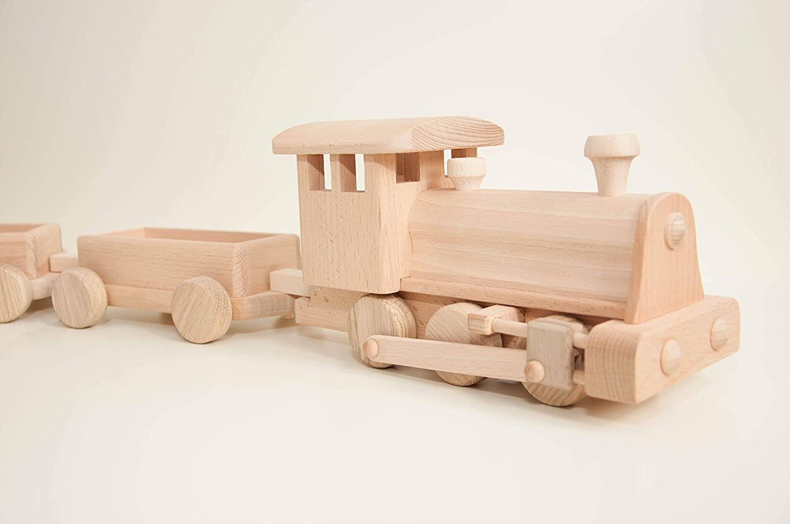
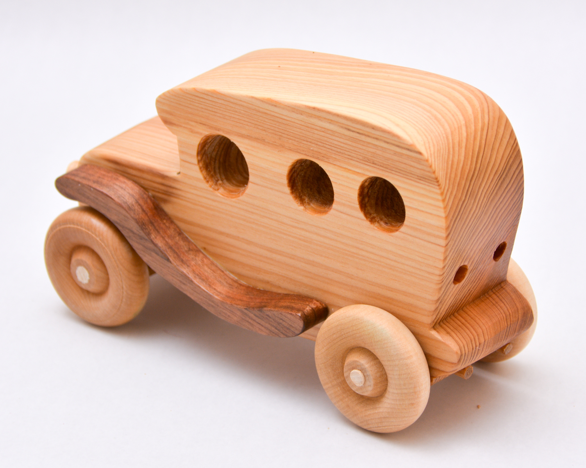

<div align="center">
  
  <h1>Little Bird Toys</h1>
  <p><em>Handcrafted wooden toys that inspire creativity and imagination</em></p>
  <a href="https://user319183.github.io/toycompany/"><strong>View Live Demo »</strong></a>
  <br><br>
  
  [](https://developer.mozilla.org/en-US/docs/Web/HTML)
  [](https://developer.mozilla.org/en-US/docs/Web/CSS)
  [](https://developer.mozilla.org/en-US/docs/Web/JavaScript)
  [](https://getbootstrap.com/)
</div>

## 📋 Overview

Little Bird Toys is a fully responsive e-commerce website for a fictional wooden toy company, showcasing handcrafted, eco-friendly wooden toys for children. This project demonstrates modern web development practices and clean UI/UX design principles.

### ✨ Live Demo

**[https://user319183.github.io/toycompany/](https://user319183.github.io/toycompany/)**

## 🚀 Features

- **Responsive Design** - Fully optimized for all devices (mobile, tablet, desktop)
- **Product Catalog** - Browse products with filtering and sorting options
- **Shopping Cart** - Add/remove items, update quantities, view order summary
- **Interactive Elements** - Animated components, modals, and transitions for enhanced user experience
- **Accessibility** - Semantic HTML and ARIA attributes for better screen reader support
- **Performance Optimized** - Fast loading times and smooth interactions

## 🛠️ Technologies

- **Frontend:**
  - HTML5
  - CSS3 (with organized structure using component-based approach)
  - JavaScript (ES6+)
  - Bootstrap 5
  - Font Awesome 6

- **Dependencies:**
  - No backend dependencies required (static site)

## 📸 Screenshots

<div align="center">
  <p><strong>Homepage with Featured Products</strong></p>
  
  
  <p><strong>Product Details</strong></p>
  
</div>

## 📦 Project Structure

```
toycompany/
├── index.html              # Homepage
├── about.html              # About page
├── products.html           # Products catalog
├── cart.html               # Shopping cart
├── contact.html            # Contact page
├── css/                    # Stylesheets
│   ├── main.css            # Main stylesheet
│   ├── components/         # Component styles
│   └── utilities/          # Utility styles
├── js/                     # JavaScript files
│   ├── main.js             # Main JavaScript
│   ├── products.js         # Product functionality
│   └── cart.js             # Cart functionality
└── images/                 # Image assets
```

## 🚦 Getting Started

### Prerequisites

- A modern web browser (Chrome, Firefox, Safari, Edge)

### Installation

1. Clone the repository:
   ```bash
   git clone https://github.com/user319183/toycompany.git
   ```

2. Navigate to the project directory:
   ```bash
   cd toycompany
   ```

3. Open `index.html` in your browser or use a local server:
   ```bash
   # Using Python
   python -m http.server
   
   # Or using Node.js live-server
   npx live-server
   ```

## 🤝 Contributing

Contributions, issues, and feature requests are welcome! Feel free to check the [issues page](https://github.com/user319183/toycompany/issues).

## 📄 License

This project is created for educational purposes only. All product images and content are fictional.

## 📬 Contact

Project Link: [https://github.com/user319183/toycompany](https://github.com/user319183/toycompany)
